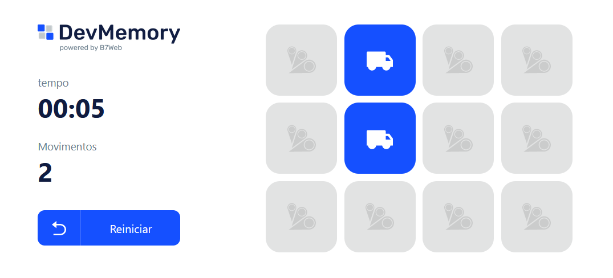

<h1 align="center">Dev Memory</h1>

 

Sumário
=================
<!--ts-->
   * [Descrição do Projeto](#about)
   * [Demonstração do projeto](#demo-project)
   * [Features](#features)
   * [Pré-requisitos e instalação do projeto](#pre-req)
<!--te-->

<h2 id="about" align="center">Descrição do Projeto</h2>

Este projeto é faz parte do curso de React da B7Web. Ele contém apenas uma página, a home neste caso, que é responsável por estruturar o app e é responsivo.

### Componentes:
- Button.tsx é um botão customizado para efetuar o reset do jogo.
- GridItem.tsx é responsável por modelar os cartões do jogo. Ele recebe os dados de cada item do jogo e a função quando efetuar o click.
- InfoItem.tsx é responsável por organizar as informações do lado esquerdo da home.tsx.

### helpers:
- formatTimeElapsed.ts faz a formatação da contagem de tempo.

<h2 id="demo-project" align="center">Demonstração do projeto</h2>
<a href="#" align="left">em breve</a>

<h2 id="features" align="center">Features</h2>

- [x] Assets: Pasta responsável por conter as imagens e ícones utilizados nos projetos.
- [x] Components: Pasta contendo os componentes do projeto.
- [x] Helpers: Contém minhas funções customizadas que são usadas na home.
- [x] Pages: Região que contém as páginas do projeto.
- [x] Styles: Região que contém todos os estilos do projeto.

<h2 id="pre-req" align="center">Pré-requisitos e instalação do projeto</h2>

Primeiro passo é clonar o projeto ou baixá-lo.

### Instalação do Projeto:
- `npm install`
### Execução do Projeto:
- `yarn start`
### Autor
---

<a href="https://marioelvio.com">
 
  
 <b>Mario Elvio</b></a> 

Feito com ❤️ por Mario Elvio 👋🏽 Entre em contato!

